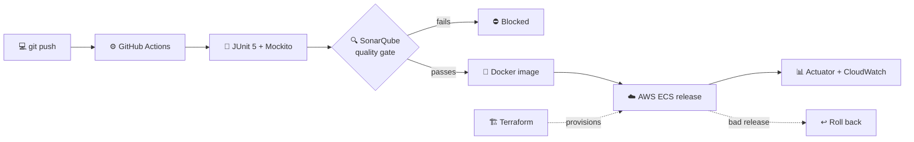

<!-- ═══════════════════════════ HEADER ═══════════════════════════ -->
<p align="center">
  
</p>

<p align="center">
  <a href="https://github.com/abdallah-mattour">
    
  </a>
</p>

<p align="center">
  <a href="mailto:abdullah.mtoor7@gmail.com"></a>
  
  
</p>

<p align="center">
  <a href="https://www.linkedin.com/in/abdullah-mattour/"></a>
  <a href="mailto:abdullah.mtoor7@gmail.com"></a>
  <!-- Uncomment and add your resume link (e.g. a PDF in this repo or Google Drive):
  <a href="LINK_TO_YOUR_RESUME"></a>
  -->
</p>

---

## ⏱️ The 30-second version

<table>
  <tr><td>🎯 <b>Looking for</b></td><td>Backend / Software Engineer roles — Java, Spring Boot, AWS</td></tr>
  <tr><td>💼 <b>Experience</b></td><td>2 years (part-time, remote) building production microservices for <b>Al Shini</b>, a retail platform</td></tr>
  <tr><td>🎓 <b>Education</b></td><td>B.S. Computer Science, <b>Birzeit University</b> — June 2026</td></tr>
  <tr><td>📍 <b>Location</b></td><td>NYC metro area · open to relocation</td></tr>
  <tr><td>🛂 <b>Work authorization</b></td><td>U.S. Permanent Resident (Green Card) — <b>no sponsorship required</b></td></tr>
  <tr><td>📈 <b>By the numbers</b></td><td>10+ services shipped · p95 &lt; 150 ms · −25% latency on key endpoints · 85% test coverage · environment setup: days → minutes</td></tr>
</table>

## 👋 About me

I'm a backend engineer who gets a little too excited when a graph goes down and to the right — latency, deploy time, manual steps.

For the last two years I worked remotely on the backend of **Al Shini's retail platform** while finishing my CS degree at Birzeit University. I shipped Java microservices handling tens of thousands of requests a day — orders, returns, customer accounts — and learned that the best production code is the boring kind: easy to test, easy to deploy, and quiet at 3 a.m.

Now I'm in the **NYC metro area** looking for my next team: somewhere I can own services end to end — design the API, write the tests, wire up the pipeline, and watch the dashboards after it ships.

## 🧭 My career, as a git log

```text
$ git log --graph --oneline career

* a7f3e91 (HEAD -> main, tag: open-to-work) feat: looking for my next backend team in the U.S.
*   9c2d4b8 Merge branch 'al-shini' — 2 years of production backend work (Jul 2026)
|\
* | 8e1f0a7 graduate: B.S. Computer Science, Birzeit University (Jun 2026)
| * 7b6c5d3 test: hold 85% coverage, enforced by SonarQube gates in CI
| * 6a4e2f1 perf: -25% response time on key order & reporting endpoints
| * 5f3d1c9 ci: environment setup from days -> minutes, manual deploy work -40%
| * 4e2b0a8 feat: ship 10+ production microservices (Java 17 · Spring Boot · PostgreSQL)
| * 3d1a9f6 init: join Al Shini retail platform as a backend engineer (Jul 2024)
|/
* 2c0f8e5 init: start B.S. Computer Science at Birzeit University (Sep 2022)
```

## 📖 Stories from production

> Resumes list results. These are the stories behind them. **Click any story to expand it.**

<details>
<summary><b>🐢 → ⚡ &nbsp;The endpoint that asked the database one question per row</b> &nbsp;·&nbsp; <code>-25% response time</code></summary>
<br/>

**🔥 The problem** — At Al Shini, our order and reporting endpoints were getting slower as the data grew. Nothing was "broken," but the endpoints the business used every day were some of the slowest we had.

**🔍 The investigation** — I followed the SQL that JPA was generating behind a single request. Loading a list of orders fired one query for the list, then one more for each order's related data. The classic N+1 problem, hiding behind clean-looking repository code.

**🔧 What I did**
- Reworked the data access so related data loaded together instead of row by row
- Tuned the slowest SQL and added indexes that matched how the endpoints actually filtered and sorted
- Added Redis caching for read-heavy responses across two REST services

**📈 The result** — Response times on key order and reporting endpoints dropped **25%**.

**💡 What I took away** — Measure before you cache. A cache on top of a bad query just hides the problem until the next cache miss.

</details>

<details>
<summary><b>🚀 &nbsp;Making deploys boring</b> &nbsp;·&nbsp; <code>days → minutes</code></summary>
<br/>

**🔥 The problem** — Standing up a new environment took days, and releases depended on manual steps someone had to remember.

**🔧 What I did**
- Built GitHub Actions pipelines that run the test suite and a SonarQube quality gate on every change
- Packaged services as Docker images and released them to AWS ECS with rollback ready
- Described the infrastructure in Terraform, so a new environment is code, not a checklist

**📈 The result** — Environment setup went from **days to minutes**, and manual deployment work dropped **40%**.

**💡 What I took away** — If a deploy needs a hero, it isn't finished. The pipeline should be the only one who has to remember the steps.

</details>

<details>
<summary><b>🔐 &nbsp;Breaking into my own app before anyone else could</b> &nbsp;·&nbsp; <code>3 vulnerabilities closed</code></summary>
<br/>

**🔥 The problem** — [SATs](https://github.com/abdallah-mattour/Manhaji) has four roles: students, parents, teachers, and admins. One authorization mistake means someone sees or changes data that isn't theirs. Before calling it done, I audited the API the way an attacker would.

**🔧 What I found and fixed**
- **Privilege escalation** — closed a gap that let users reach permissions above their role
- **Refresh tokens acting as access tokens** — each token type is now accepted only where it belongs
- **Answers submitted to someone else's quiz** — the API now verifies that every answer belongs to the student's own attempt and quiz

**📈 The result** — Every fix shipped with regression tests, inside a suite of **240+ tests**, so none of these can quietly come back.

**💡 What I took away** — Every ID in a request is a claim, not a fact. Check that it belongs to the person asking.

</details>

<details>
<summary><b>🧬 &nbsp;Changing the user model without breaking a single foreign key</b> &nbsp;·&nbsp; <code>zero broken references</code></summary>
<br/>

**🔥 The problem** — The SATs user model had to grow into four distinct roles, each with its own data. That meant restructuring the table almost every other table points to.

**🔧 What I did**
- Refactored to **JPA joined-table inheritance**: a shared `users` table plus `student`, `teacher`, `parent`, and `admin` tables
- Wrote the MySQL migration that copied existing rows into the new structure **while preserving primary keys**

**📈 The result** — Every existing foreign key kept working after the switch.

**💡 What I took away** — A schema change is really a data change. Design the migration before you touch the entity.

</details>

<details>
<summary><b>🤖 &nbsp;Putting an LLM in the request path, without trusting it</b> &nbsp;·&nbsp; <code>3,000+ questions</code></summary>
<br/>

**🔥 The problem** — SATs needed far more practice questions than anyone could write by hand.

**🔧 What I did**
- Built Python pipelines that extracted **3,000+ questions** from PDF textbooks to seed the question bank
- Integrated **Gemini** through Spring WebClient to generate new questions at quiz time
- Saved only questions that pass validation, and wrapped the call in a **10-second timeout** with a **fallback to the question bank**

**📈 The result** — When the model is fast and correct, students get fresh questions. When it isn't, they get a normal quiz. The AI is never a single point of failure.

**💡 What I took away** — Treat an LLM like any other flaky dependency: timeout, validate, fall back.

</details>

<details>
<summary><b>🗺️ &nbsp;A workflow engine that knows how to say no</b> &nbsp;·&nbsp; <code>12 states, 0 shortcuts</code></summary>
<br/>

**🔥 The problem** — In [LRMIS](https://github.com/abdallah-mattour/land-registration-management-system), a land application moves between applicants, registrars, and surveyors. If an application could skip a step, a parcel could be registered without being surveyed.

**🔧 What I did** (team of 3)
- Built the **workflow engine** at the core of the platform: 12 application states with per-state guards that reject invalid transitions **on the server**
- Added an **append-only audit trail** of every state change
- Added GeoJSON polygon validation, so invalid parcels never reach the survey step

**📈 The result** — The only way through the system is the correct way, and every step leaves a record.

**💡 What I took away** — The UI can hide a button. Only the backend can refuse a request. Business rules belong on the server.

</details>

## 🛤️ From `git push` to production

The delivery pipeline pattern I built and ran at Al Shini:



## 🏗️ Featured projects

<table>
  <tr>
    <td width="50%" valign="top">

### 📚 [SATs](https://github.com/abdallah-mattour/Manhaji)
**Adaptive learning platform:** a Spring Boot REST API and Flutter app where quizzes adjust to each student's mastery, for students, parents, teachers, and admins.

**What I built**
- Security audit and fixes: privilege escalation, token misuse, answer ownership
- Joined-table user inheritance with a key-preserving MySQL migration
- Gemini question generation with validation, timeout, and fallback
- PDF-to-question-bank pipelines (3,000+ questions)

`Java 17` `Spring Boot` `Spring Security` `JPA` `MySQL` `WebClient` `Flutter`

</td>
    <td width="50%" valign="top">

### 🗺️ [LRMIS](https://github.com/abdallah-mattour/land-registration-management-system)
**Land registration system:** a workflow-driven, geo-enabled, bilingual (Arabic/English) platform for applicants, registrars, and surveyors. Team of 3.

**What I built**
- Workflow engine: 12 states, server-side guards, append-only audit trail
- 11 analytics endpoints on 13 MongoDB aggregation pipelines, with a 60-second TTL cache
- MongoDB layer: 15 collections with unique, TTL, and 2dsphere indexes, atomic ID counters, GeoJSON validation

`Python` `FastAPI` `MongoDB` `React` `Leaflet`

</td>
  </tr>
</table>

<sub>Also on my GitHub: ⚽ <a href="https://github.com/abdallah-mattour/Anatomy-of-a-Goal">Anatomy-of-a-Goal</a> (football data analysis) · ✈️ <a href="https://github.com/abdallah-mattour/Flight-Delay-Project">Flight-Delay-Project</a> (machine learning on flight delay data)</sub>

## 🛠️ Tech stack

<p align="center">
  
</p>

| Area | Tools |
|:--|:--|
| **Languages** | Java 17+, Python, SQL, JavaScript |
| **Backend** | Spring Boot, Spring MVC, Spring Data JPA, Spring Security, Spring WebClient, FastAPI, Gradle |
| **APIs & architecture** | REST, microservices, RBAC, JWT, OAuth2, API versioning, pagination, Swagger/OpenAPI |
| **Data** | PostgreSQL, MySQL, MongoDB, Redis, Liquibase |
| **Cloud & DevOps** | AWS (ECS, EC2, S3, IAM, CloudWatch), Docker, Kubernetes, Terraform, GitHub Actions |
| **Quality & monitoring** | JUnit 5, Mockito, SonarQube, TDD, Postman, Spring Boot Actuator |
| **Ways of working** | Git, Jira, Agile/Scrum |

## 📊 GitHub stats

<p align="center">
  <picture>
    <source media="(prefers-color-scheme: dark)" srcset="https://github-readme-stats-five-sigma-99.vercel.app/api?username=abdallah-mattour&show_icons=true&theme=tokyonight&title_color=f43f5e&icon_color=f43f5e&hide_border=true&bg_color=00000000&count_private=true" />
    
  </picture>
  <picture>
    <source media="(prefers-color-scheme: dark)" srcset="https://github-readme-stats-five-sigma-99.vercel.app/api/top-langs/?username=abdallah-mattour&layout=compact&theme=tokyonight&title_color=f43f5e&hide_border=true&bg_color=00000000&langs_count=8" />
    
  </picture>
</p>

## 🤝 Let's build something reliable

If your team needs someone who makes slow things fast and manual things automatic, I'd love to talk.

<p align="center">
  <a href="https://www.linkedin.com/in/abdullah-mattour/"></a>
  <a href="mailto:abdullah.mtoor7@gmail.com"></a>
</p>

<p align="center">
  
</p>
